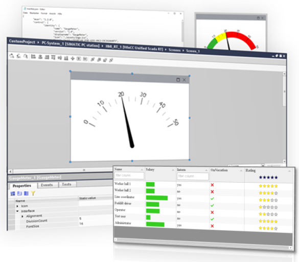

# CWC-in-WinCC-Unified

An example will be used to demonstrate how you can integrate a "Custom Web Control", created with Visual Studio Code, into WinCC Unified.

This guide is also available in [SIOS](https://support.industry.siemens.com/cs/document/109779176/integrating-user-defined-controls-into-wincc-unified-(custom-web-controls)?dti=0&lc=en-US).

- [CWC-in-WinCC-Unified](#cwc-in-wincc-unified)
  - [Description](#description)
    - [Overview](#overview)
    - [General Task](#general-task)
  - [Requirements](#requirements)
    - [Prerequisites](#prerequisites)
    - [Used components](#used-components)
  - [Documentation](#documentation)
  - [Contribution](#contribution)
  - [License and Legal Information](#license-and-legal-information)

## Description

### Overview

WinCC Unified offers the ability to integrate Custom Web Controls. Thus, your visualization is no longer limited to WinCC Unified's default controls.

You have the ability to create your customer-specific controls with web technology or to use existing controls and deploy them on other WinCC Unified runtime stations or Unified Comfort Panels. Some of the controls are not suitable for Unified Basic Panels due to limited system resources.

The aim of this application example is to show you, using examples, how to integrate a "Custom Web Control" created with Visual Studio Code into WinCC Unified.

### General Task

WinCC Unified offers an option for custom web controls (or CWC for short). You have the option of creating your own custom controls using web technology or using existing controls and applying them to other WinCC Unified Runtime stations.

This application example explains how to integrate a "custom web control" created with Visual Studio Code into WinCC Unified. See the [documentation](#documentation) part for more information.

> **Note:** Custom Web Controls and the following configuration steps work with the WinCC Unified PC Runtime
and the Unified Comfort Panels.
Please note the limited performance of Unified Comfort Panels. Custom web controls with 3D
representations are not recommended for Unified Control Panels, for example.

## Requirements

### Prerequisites

The application example assumes the following basic knowledge:

- Configuration with WinCC Unified. The fundamentals are taught in the SITRAIN course "SIMATIC WinCC Unified 1 (TIA-UWCC1) - System Course".
See article ID [109773211](https://support.industry.siemens.com/cs/document/109773211/sitrain-learning-event-simatic-wincc-unified-1-system-course-(tia-uwcc1)?dti=0&lc=en-WW).
- Microsoft Visual Studio Code.
- Web page programming with HTML5 and JavaScript.

### Used components

- WinCC Unified V19.
- Microsoft Visual Studio Code (See [reference](https://code.visualstudio.com/)).
- GaugeMeter CWC (See [GitHub repository](https://github.com/tia-portal-applications/GaugeMeter)).
- Gauge.js 1.3.8 (See [reference](https://bernii.github.io/gauge.js/)).
- TableControl CWC (See [GitHub repository](https://github.com/tia-portal-applications/TableControl)).
- Tab v6.2 (See [reference](https://tabulator.info/)).
- Toolbox CWC (See [GitHub repository](https://github.com/tia-portal-applications/Web-Toolbox_CWC)).

The components listed here can be obtained from the [Siemens Industry Mall](https://mall.industry.siemens.com/goos/WelcomePage.aspx?regionUrl=/es&language=es).

## Documentation

You can find information about the engineering of a Custom Web Control in the following document:

▶️💡[Engineering a Custom Web Control](docs/engineering_CWC.md).💡◀️

You can find further documentation and help in the following external link:

[SIMATIC HMI WinCC Unified Programming Custom Web Controls](https://support.industry.siemens.com/cs/document/109794040/simatic-hmi-wincc-unified-programming-custom-web-controls?dti=0&lc=en-US)

## Contribution

Thank you for your interest in contributing. Anybody is free to report bugs, unclear documentation, and other problems regarding this repository in the Issues section.
Additionally everybody is free to propose any changes to this repository using Pull Requests.

Please attach the signed Contribution License Agreement [CONTRIBUTING.pdf](CONTRIBUTING.pdf) to your first Pull Request.
Thank you for Contributing!

## License and Legal Information

Please read the [Legal information](LICENSE.md).
