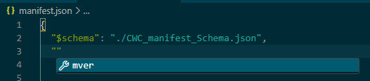

# Engineering a Custom Web Control

This section uses an example to show how to create a custom web control with Visual Studio Code and integrate other custom web controls into your project.

- [Engineering a Custom Web Control](#engineering-a-custom-web-control)
  - [Configuration and Implementation of a basic Custom Web Control](#configuration-and-implementation-of-a-basic-custom-web-control)
  - [Installation and Integration into the User Project](#installation-and-integration-into-the-user-project)
  - [Autocomplete during programming](#autocomplete-during-programming)
  - [Gauge Meter](#gauge-meter)
    - [Overview](#gauge-meter-overview)
    - [Principle of operation](#gauge-meter-principle-of-operation)
    - [Engineering](#gauge-meter-engineering)
    - [Operation demo](#gauge-meter-operation-demo)
  - [Table Control](#table-control)
    - [Overview](#table-control-overview)
    - [Principle of operation](#table-control-principle-of-operation)
    - [Engineering](#table-control-engineering)
    - [Operation demo](#table-control-operation-demo)
  - [Toolbox](#toolbox)
    - [Overview](#toolbox-overview)
    - [Principle of operation](#toolbox-principle-of-operation)
    - [Engineering](#toolbox-engineering)
    - [Operation demo](#toolbox-operation-demo)
  - [Debugging](#debugging)
  - [Common error patterns](#common-error-patterns)
  - [Helpful information](#helpful-information)

## Configuration and Implementation of a basic Custom Web Control

This section uses an example to show how to create a custom web control with Visual Studio Code.

> **Note:** Other text-based development environments can also be used.<br>If you're not very familiar with the topic, or if you're not familiar with Visual Studio Code software, for example, see Section 6, Helpful Information, for a brief introduction.

### Create a custom web control

1. Create folder structure<br>
  (See also the manual referred to in "General Configuration and Folder Structure.")
  Open Windows Explorer and create the following items in a working folder of your choice:

    1. File with the file name "manifest.json"

    2. Folder with the name "assets".<br>
    Place an icon in any graphic format in this folder. It is displayed in the TIA Portal for this Control.

    3. Folder with the name "control".<br>
    Create the files: "index.html", "code.js", "styles.css" and a folder "js" in which you store the file "webcc.min.js" from the attached files in this application example and the file "gauge.min.js" with the downloaded code (source: [gauge.js](https://bernii.github.io/gauge.js/)).

2. Open Visual Studio Code:

    1. Open Visual Studio Code (or a different editor).

    2. Select "File" > "Open Folder" to open the folder in which the folder structure you just created is stored.

    

3. Prepare the Manifest.json file:<br>
    (See also the manual referred to in "Contract-Based Interaction and the Manifest File.")

    1. Open the Manifest.json file in Visual Studio Code (or in another editor). This file requires a certain structure, which is described in more detail in the manual. For this application example, it is sufficient to copy an existing file and make some adjustments.

    2. To create a new custom web control, copy the contents of the Gauge sample manifest.json file to your manifest.json.

        

    3. Give your custom web control a custom name under the "Name" attribute on lines 6 and 8.

    4. Customize the name of your logo on line 9 (all common graphic formats, such as JPG, PNG, BMP, etc. are possible).

    5. In line 10, assign a new, custom GUID. You can create one using an online generator like [guidgenerator.com](https://www.guidgenerator.com/).

    6. If necessary, adjust the metadata in line 13.

    7. If necessary, change the interface of your custom web controls from line 20. Possible data types include: "boolean", "number", "string", "array", or one of your own defined data types starting at line 80 (See the included Manifest.json file for usage information.)

        >**Note:** To ensure that you have created a valid JSON file, open it in Visual Studio Code or copy the content of the file into an online validation tool (such as [jsonlint](https://jsonlint.com): Paste the content and click "Validate JSON" at the bottom left).

4. Index.html file (See also the manual referred to in "Interaction between Control and Container via API"):

    1. Open the Index.html file in Visual Studio Code (or in another editor). This file is the portal to your website. Here you also establish a connection to the WinCC Unified Runtime server for data exchange.

    2. The connection data for WinCC Unified can be found in the attached file "webcc.min.js". Move it to the "js" folder and reference the file as follows in index.html:

        ```html
        <script src="./js/webcc.min.js"></script>
        ```

        This referencing is best done in your \<Head> variable (see also line 11 of the attached example).

        

    3. The connection is made using the **WebCC.start()** function in file code.js (on line 241), which is included in the attached files.

        

        It is therefore important that the connection is established correctly when the page is accessed. This is best achieved if the function (as in the example) is located directly in the \<script> tag and not in a deeply nested function that may only be called at a later time (see previous Figure, line 19).

5. Data exchange between custom web control and WinCC<br>
    (See also the manual referred to in "Using the Control via WinCC"):

    1. You can now access the data defined in the Manifest.json file from anywhere in your application.

    2. Access is provided with the "WebCC" API object. You've already used it to make the connection. Now you have more options.

    3. For example, if you want to read or write properties (in the file Manifest.json under "properties" starting at line 42), you can access the "GaugeValue" property with write access as follows:

        ```js
        WebCC.Properties.GaugeValue = 5
        ```

        It sets the value to 5. The value of the linked WinCC variable is also set to 5.

    4. If you want to change the connected WinCC variables (perhaps a PLC variable), use the

        ```js
        WebCC.onPropertyChanged.subscribe()
        ```

        You should call this function immediately after the connection is successfully established to get all the changes from the start (see lines 245 and 259). Use a function defined by you (callback function) as a transfer parameter. In this example, it is the function "setProperty" in the file code.js in line 125. With each data change, the "setProperty" function is called and a "data" object is passed that contains a "key" and a "value". The "key" is the name of the changed property and the "value" is the new value. It is therefore recommended to program branch points with switch-case for correct processing of the new value.

        

    5. If you have declared methods in the Manifest.json file (line 22 in the "manifest.json" file), WinCC can call these methods and you can react to them in the custom web control. WinCC can call these methods at any time. This means that you must always define what should happen before making the connection. You define a function with the exact name you specified in the Manifest.json file and also the same parameters. You can find an example of this in the attached code.js file on line 268.

    6. If you have defined an event in the file Manifest.json (see line 32), you can fire that event anywhere in your code with **WebCC.Events.fire()** so that WinCC is notified. In this case, the first transfer parameter is always the name of the event that you want to trigger, followed by all transfer parameters in the correct order that you have specified in the Manifest.json file. You can find an example of this in the attached code.js file in line 69.

6. Deployment process for using the custom web control in the TIA Portal (see also the manual referred to in "Creating the ZIP file"):

    1. When you have finished programming, you still need to package the code so that the TIA Portal recognizes your custom web control correctly.

    2. To do this, open Windows Explorer and go to your project folder. Select the originally created folders "assets", "control, the file 'CWC_manifest_Schema.json' (for this file see this [section](#autocomplete-during-programming)) and the file 'manifest.json' and archive them by right-clicking (1) > "Send to" (2) > "Compressed (zipped) folder" (3).

        

    3. Use your GUID file from the Manifest.json file to change the name of your created .zip file as follows (the Xs are your GUID):

        ```js
        {xxxxxxxx-xxxx-xxxx-xxxx-xxxxxxxxxxxx}.zip
        ```

        Please note the curly brackets before and after the GUID.

        

    4. Your custom web control is now complete and ready for use in the TIA Portal.

## Installation and Integration into the User Project

### Installation in the TIA Portal

Before you can use the custom web control in the TIA Portal, you have two procedures for installing it (see also the official manual under "Installing a custom web control"):

1. Only make available for a specific project:<br>Add your custom web control to your project folder: 

```sh
"...\Project_1\UserFiles\CustomControls\ {xxxxxxxx-xxxx-xxxx-xxxx-xxxxxxxxxxxx}.zip"
```

2. Make available for all projects:<br>Add your custom web control to the TIA Portal installation path:<br>

```sh
"C:\Program Files\Siemens\Automation\Portal Vxx\Data\Hmi\CustomControls\{xxxxxxxx-xxxx-xxxx-xxxx-xxxxxxxxxxxx}.zip"
```

> **Note:** If you copy the project to another PC, the custom web controls will not be submitted, and a compilation error will occur in the TIA Portal project. You will also need to copy the custom web controls to the new computer and to the directory specified above.

> **Note:** When you upload a project to the Operator Panel, the TIA Portal also transmits your custom web control. There is no installation on the Runtime server.

### Integration into the user's project

To configure your custom web control in the TIA Portal project, proceed as follows:

1. Open an screen for your Unified Comfort Panel or PC station.

2. Click your custom web control under "Tools > My Controls" and drag and drop it onto the screen.<br>
   <br> In the properties of your custom web controls, under "Interface", you will find all the properties that you have defined in the Manifest.json file. As with all other screen object properties, you can assign a static value to these or define dynamization.

3. Dynamize custom web control

   1. Create a dynamization "tag" for "GaugeValue".

   2. Select a compatible PLC or HMI tag.

   3. If your custom web control only has read access to the tag, the box should remain checked. However, if your implementation provides for the custom web control to change your tags, then deactivate the checkbox. In this case, the "GaugeMeter" only displays the tag (read).

      

## Autocomplete during programming

In this Section you will learn how to activate auto-complete.

### JSON Manifest Schema

To support the creation of the "manifest.json", you need a file that specifies the schema to enable auto-completion (see
step 3 in [this section](#configuration-and-implementation-of-a-basic-custom-web-control)). This is then placed at the same file level as the "manifest.json" file. To do this, copy the file
"CWC_manifest_Schema.json" next to the "manifest.json"


Now you need to specify the path of the template in the "manifest.json". It is sufficient to specify the path to the template
immediately after starting the file. The parameter "$schema" is used for this purpose. In this case: insert the following line
after the first opening curly bracket:

```json
"$schema": "./CWC_manifest_Schema.json"
```

Save the changes. You can now use the auto complete.



### Scripting support with webcc.d.ts

For the auto-completion in the script part, you need the webcc.d.ts file (see steps 4 and 5 of [this section](#integration-into-the-users-project)). It contains the
relevant information for the WebCC object and must be in the same folder as the index.html file. This part of the script is
included in the code.js file because Visual Studio Code's scripting support only works in a .js file, not in the index.html.


The CWC must be referenced in order to be able to locate scripts in the "code.js". You can do this with the following code
snippet:

```html
<script src="./code.js"></script>
```


### Result

As a result, you get auto complete and a clear separation of the scripts.


## Gauge Meter

### Gauge Meter Overview

The figure shows the "Gauge" custom web control, which is used as an example to demonstrate the individual configuration steps for integration in WinCC Unified.

The example control comes from the open source library "Gauge.js" from a third-party provider and is extended with code for use in WinCC Unified.


### Gauge Meter Principle of Operation

The complete custom web control has the following functions:

- Displaying a WinCC Unified tag value on a Gauge Control
- Defining upper and lower limits
- Define various style parameters for a better display
- Defining value ranges with different colors
- Method for flashing the area in which the value is currently located
- Event that occurs during the transition from one zone to another

### Gauge Meter Engineering

Since the Gauge Control us the simplest of the three CWCs presented here, you can find where the parameters are engineered in this [section](#integration-into-the-users-project).

### Gauge Meter Operation Demo

The sample project consists of three tabs. In the first tab, you will find the CWC "Gauge", in which four properties (via I/O fields) as well as the process value (via sliders) can be dynamized as an example.


## Table Control

### Table Control Overview

The following is another application example for creating custom web controls. The custom web control "Table" is a tabular display of values. You can not only display the values, but also format them graphically (see figure below).

For this example, the JavaScript library "Tabulator" (see [Tabulator](http://tabulator.info)) was used and supplemented with code so that it can be used in WinCC Unified.


### Table Control Principle of Operation

With the "Table" custom web control you have the following options:

- Create a table based on submitted WinCC Unified variable values (e.g., process values, parameter setpoints).
- Save all table values in a string tag.
- Customize table columns individually (width, display format of the values, filter options for the values).

The tables of the custom web control are suitable for the following purposes, among others:

- Output of the values of a CSV file as a table in WinCC Unified Runtime.
- Graphical representation of the process values within a table.
- Exporting the process values as a CSV file.

### Table Control Engineering

To create a table, two strings must be passed to the following two properties of the "Table" custom web control:

- "ColumnStyleString": String for formatting the columns
- "TableDataString": String with data entries (table content)

#### ColumnStyleString

"ColumnStyleString" (string in JSON format) defines the layout of the table columns.

An example of a "ColumnStyleString" structure for the "Name" column is shown in the following figure.


| No. | Parameter    | Description                                                                                                                                                                                                 |
| --- | ------------ | ----------------------------------------------------------------------------------------------------------------------------------------------------------------------------------------------------------- |
| 1.  | title        | Defines the name of the column in the custom web control                                                                                                                                                    |
| 2.  | field        | Used to assign the values (from the "TableDataString") when filling the table. <br>**Note:** Make sure that the spelling of the values is correct, otherwise they cannot be assigned to the "title" column. |
| 3.  | sorter       | Specifies the attribute by which the list is sorted.                                                                                                                                                        |
| 4.  | width        | Defines the column width.                                                                                                                                                                                   |
| 5.  | headerFilter | Optional: Creates a filter in the column header.                                                                                                                                                            |

You can not only simply display the values, but also format them graphically. If necessary, specify this using additional
parameters, such as "hozAlign", "formatter" and "formatterParams".


> **Note:** See the following link for a detailed description of the formatting options: [Tabulator Formatting Options](http://tabulator.info/docs/4.9/format)

#### TableDataString

The "TableDataString" (string in JSON format) contains the values with which the individual columns are to be filled. Its
structure consists of the "field" name of the "ColumnDataString" and the value that is to be inserted in the corresponding
table row.

> **Note:** In Section 4.1 "Gauge" Custom Web Control usage, the build of "ColumnStyleString" and "TableDataString" in the application is explained again using the sample project.
> <br>You can find more information about the properties at [Tabulator](http://tabulator.info/).

> **Note:** If a parameter is empty or a control is not connected correctly, the custom web control does not display the table correctly (see this [common error](#tia-portal-does-not-display-the-custom-web-control-correctly-in-the-screen)).

### Table Control Operation Demo

The "Table" custom web control will be presented with three ways in which you can supply the custom web control with the required data (see [table control engineering](#table-control-engineering)).

- Script: Table contents are stored in a script
- Screen object: Table contents are stored in a screen object (e.g., text field).
- CSV file: Table contents are included in a CSV file or need to be exported.

#### Submission of Table Contents via a Script

In the first example, the values are simply displayed in two columns. The two strings ("ColumnTableString" and "TableDataString") are passed to the CWC via the "Draw default table" button.


##### ColumnStyleString

For this example, the "ColumnStyleString" is composed as follows:

```json
'[{"title":"Name", "field":"name", "sorter":"string", "width":150},
  {"title":"Salary", "field":"salary", "sorter":"number","hozAlign":"left"}]'
```

##### TableDataString

For this example, the TableStyleString is composed as follows:

```json
'[{"name":"Donald","salary":"2000"},
  {"name":"Mickey","salary":"2100"}]'
```

> **Note:** Line breaks have been added to the two strings in the documentation to improve readability.

#### Transmission of Table Contents via a Screen Object

In the second example, the table contents are displayed graphically formatted. In addition, a filter has been added to the "Name" and "Rating" columns in order to filter the entries. The two strings ("ColumnTableString" and "TableDataString") were also stored in a screen object (in this example as a text field).

The format ("ColumnStyleString") is first transferred to the CWC via the "1 Set Style" button. The table content ("TableDataString") is then transferred using the "2. Set data" button.


##### ColumnStyleString

For this example, the "ColumnStyleString" is composed as follows:

```json
'[{"title":"Name", "field":"name", "sorter":"string", "width":150, "headerFilter":"input"},

{"title":"Salary", "field":"salary", "sorter":"number", "formatter":"progress",
"formatterParams":{"min":0, "max":10000}, "hozAlign":"left"},

{"title":"onvacation", "field":"onvacation", "formatter":"tickCross", "width":150},

{"title":"Rating", "field":"rating", "formatter":"star", "hozAlign":"center",
"headerFilter":true, "width":200}]'
```

##### TableDataString

For this example, the TableStyleString is composed as follows:

```json
[
  { "name": "Donald", "salary": "2000", "onvacation": "true", "rating": 4 },
  { "name": "Mickey", "salary": "2100", "onvacation": "false", "rating": 2 },
  { "name": "Goofey", "salary": "2300", "onvacation": "true", "rating": 4 },
  { "name": "Pluto", "salary": "2300", "onvacation": "true", "rating": 1 },
  { "name": "Dagobert", "salary": "50000", "onvacation": "false", "rating": 5 }
]
```

> **Note:** Line breaks have been added to the two strings in the documentation to improve readability.

#### Transfer of Table Contents via a CSV File

In the third use case, the values are displayed both raw ("Read File 1") and formatted ("Read file 2").

> **Note:** In the project directory of the sample project <br>("109779176_CustomWebControl_V30_PROJ\UserFiles") there are already two preconfigured CSV files. If you want to use them in the sample project, you must place both files (Folder 1 and Folder 2) in the following location on the Operator Panel you are using.<br>
    - Unified PC Runtime: "C:\Users\Public”<br>
    - Unified Comfort Panel: "\home\industrial\"

The string "ColumnTableString" is stored in the script of the respective button. It defines the raw or formatted display form.

The TableDataString table data is read from a CSV file and converted to JSON format by a script before being passed to the CWC.


##### ColumnStyleString

The "ColumnStyleString" is composed as follows for the unformatted example:

```json
'[{"title":"Name", "field":"name", "sorter":"string", "width":150},
{"title":"Salary", "field":"salary", "sorter":"number", "hozAlign":"left"},
{"title":"Intern", "field":"intern", "sorter":"boolean", "hozAlign":"left"}]'
```

The "ColumnStyleString" is composed as follows for the formatted example:

```json
'[{"title":"Name", "field":"name", "sorter":"string", "width":150, "headerFilter":"input"},

{"title":"Salary", "field":"salary", "sorter":"number", "formatter":"progress",
"formatterParams":{"min":0, "max":10000}, "hozAlign":"left"},

{"title":"OnVaccation", "field":"onvaccation", "formatter":"tickCross", "width":150},

{"title":"Rating", "field":"rating", "formatter":"star", "hozAlign":"center",
"headerFilter":true, "width":200}]'
```

##### TableDataString

For this example, the "TableStyleString" is as follows:

```js
HMIRuntime.FileSystem.ReadFile("C:\\Users\\Public\\Mappe1.csv", "utf8").then(

  function(text) {
    //read file and convert to a string in JSON format
    var lines = text.split("\n");
    var result = [];
    var headers;
    headers = lines[0].split(";");

    for (var i = 1; i < lines.length; i++) {
      var obj = {};

      if(lines[i] == undefined || lines[i].trim() == "") {
          continue;
      }

      var words = lines[i].split(";");

      for(var j = 0; j < words.length; j++) {
        obj[headers[j].trim()] = words[j];
      }

      result.push(obj);
  }
  
  //write to Interface
  Screen.Items('MyCWC').Properties.TableDataString = JSON.stringify(result);
```

## Toolbox

### Toolbox Overview

The figure shows the icon of the "Toolbox" custom web control. This becomes visible as soon as the control has been
successfully added to the TIA project.

The control can be downloaded via the GitHub link of the article page in SIOS. It is constantly maintained and developed.


### Toolbox Principle of Operation

The full custom web control has the following methods:

- Download: Downloads the content to the user in the specified file name.
- switchUrl: Changes the current URL to change the Unified website to another website.
- takeScreenshot: Takes a screenshot of the website and downloads it as a PNG to the client device.
- openNewWindow: opens a new window with the given URL and the specified width and height.
- closeWindow: Closes the oldest window opened by openNewWindow.
- openScreenOnMonitorX: opens new windows with the screens specified in the interface values.
- checkFullscreen: checks the URL and the specified interface values for the transition to fullscreen mode, only works together with openScreenOnMonitorX.
- playSound: plays a sound file in the client browser, e.g., as an alarm horn.
- openNewTab: opens the specified URL in a new tab.

### Toolbox Engineering

The custom web control (CWC) "Toolbox" is invisible because it has no user interface. When used in the project, the border
and header bar can be hidden from the window settings. It is also possible to set the CWC to invisible in the settings. This
custom web control is a collection of useful functions that extend the functionality of WinCC Unified.


<br>

#### The control has the following features:

##### Properties

- Screens: Specifies the screens, with their position and size, to be opened by openScreenOnMonitorX
- TabTitle: This property allows you to customize and override the title of the browser tab. You can define a static value or even dynamically design the tab title to display different values in different states of the machine.

##### Methods

- Download: Downloads the content to the user in the specified file name
- switchUrl: Changes the current URL to change the Unified website to another website
- takeScreenshot: Takes a screenshot of the website and downloads it as a PNG to the client device
- openNewWindow: opens a new window with the given URL and the specified width and height
- closeWindow: Closes the oldest window opened by openNewWindow
- openScreenOnMonitorX: opens new windows with the screens specified in the interface values
- checkFullscreen: checks the URL and the specified interface values for the transition to fullscreen mode, only works together with openScreenOnMonitorX
- playSound: plays a sound file in the client browser, e.g., as an alarm horn
- openNewTab: opens the specified URL in a new tab

##### Events

- SizeChanged: triggers whenever the screen width or height changes
- URL: triggers with the creation of the CWC
- Touched: triggers
- UnifiedInContainer: triggers with the creation of the CWC
- IsMonitorMode: triggers when the CWC is created

#### Application of the Methods

The methods of the control can be triggered in the TIA Portal via scripting. A button can be used for this. The methods can then be called via any event. In this case, the "openNewTab" method is triggered via the button's "Press" event. To trigger the methods, the CWC must be properly referenced as shown below. So it should be included on the respective screen.


The following describes all the methods of the "Toolbox" custom web control:

##### Download Method

The download method creates a new text file with the name "Protocol.txt" (can also be .csv) and the content "2020-01-01 Happy New Year…". If the second parameter is missing, this file is searched for on the internet and downloaded directly into the client's browser so that it can be opened on the device (e.g., tablet, smartphone, PC).

```js
Screen.Items('Toolbox').Download('Protocol.txt', '2020-01-01 Happy New Year \n 2020-01-02 Machine is up and running \n');
```

##### openNewTab Method

The openNewTab method opens a new tab in the client's browser with the specified URL, e.g., <http://siemens.com/>.

```js
Screen.Items('Toolbox').openNewTab('http://siemens.com/');
```

##### openNewWindow Method

This method opens a new browser window with the specified URL, e.g., <http://siemens.com/> and the specified width and height in pixels.

```js
Screen.Items('Toolbox').openNewWindow('http://siemens.com/', 1920, 1080);
```

##### closeWindow Method

The closeWindow method closes the oldest window opened by openNewWindow().

```js
Screen.Items('Toolbox').closeWindow();
```

##### takeScreenshot Method

The takeScreenshot method takes a screenshot of the current user view in the browser as a PNG. This PNG is downloaded
directly to the client's browser so that it can be opened on the device (e.g., tablet, smartphone, PC).

```js
Screen.Items('Toolbox').takeScreenshot();
```

##### openScreenOnMonitorX Method

The openScreenOnMonitorX method checks your monitors and the window placement API. It will then open as many new
windows as there are screens specified in the interface. The new windows will all open with the screen of the CWC, but
the URLs are different, to access the new screens, call this function in the "Url" event.

```js
Screen.Items('Toolbox').openScreenOnMonitorX(url, actScreen);
```

##### checkFullscreen Method

The checkFullscreen method helps to get into fullscreen mode, requires user action (click anywhere on the screen), and
only works with changed URL of the openScreenOnMonitorX method.

```js
Screen.Items('Toolbox').checkFullscreen();
```

##### playSound Method

The playSound method plays a standard sound file in your client browser. This can be used as an alarm horn, for example.
Together with AlarmSubscriptions, the sound can also be triggered by an attached alarm. It is possible to provide several
sound files in the CWC. To do this, the respective sound file must be made available in the CWC folder under
"./Control/dist/media".

```js
Screen.Items('Toolbox').playSound("./dist/media/Alarm01.wav");
```

##### switchUrl Method

This method swaps the current URL with the specified URL and presses Enter.

```js
Screen.Items('Toolbox').switchUrl('http://siemens.com/');
```

#### Configuration of the Interface

The behavior of the custom web control can also be modified by the following properties from the manifest file. The function "openScreenOnMonitorX" checks the entries from the interface and can be configured via them. These characteristics are explained in more detail height in pixels.


The screens contain the information for new windows to open at a defined position and size, as well as a screen to switch to.

- Fullscreen: if enabled, it ignores the height, left, top, and width and attempts to switch to full-screen mode.
- Height: specifies the height of the new browser window in pixels.
- Left: specifies the x position within the monitor screen where the new browser window should be placed.
- MonitorNumber: specifies the monitor on which to place the new browser window. The monitor at the top left is number 1 and the bottom right is the last number.
- Top specifies the Y position within the monitor screen where the new browser window should be placed.
- UnifiedScreenName: specifies the Unified screen to open in the new browser window.
- Width: specifies the width of the new browser window in pixels.

The following figure shows the properties in the TIA Portal, which can be set statically or dynamized.


### Toolbox Operation Demo

In the third tab, you will find the "Toolbox" custom web control. In the "Methods" area, the various methods of the control
can be triggered. To the right of it are IO fields, which interact with the CWC in a variety of ways. The web control can be
used to illustrate the "UnifiedInContainer" event. Below that is the CWC and an alarm control.


#### Methods

The following methods can be triggered via the buttons in the top left.

- The "Open new tab" button opens a new browser tab. In our sample project, the web page "<http://new.siemens.com>" is linked in the code of the button. The link can be adapted in Engineering.
- "Open new Window" also opens a new browser tab, but in this case as a new window. Again, the web page "<http://new.siemens.com>" is linked in the code of the button.
- "Close Window" closes the new browser window that has just been opened.
- The "Take Screenshot" button opens a browser dialog. In this view, you can choose from which view a screenshot should be taken. This feature is browser-dependent and may vary.

  

- Download file with content creates a file with content from Runtime. The file name and content can be dynamically adjusted further to the right in the "Presets" area.
- "Trigger Alarm" and "Play Alarm Sound" are available for the demonstration of the alarm horn feature. When the alarm is triggered, a sound will be played along with it. The code for linking the sound file to the alarm can be found in the Loaded event of the screen. An alarm subscription is required for this. The type of alarm and the respective sound can be set individually. For example, ".Filter" can be used to define the alarm class that should apply to a specific sound file.

  

  In this example, the filter in line 5 for the "Name" attribute was set to "Discrete_alarm_1". This means that the
  sound file is only played for this alarm.

  >**Note:** New sounds can be stored in the folder of the custom web control under "./dist/audio".
- The OpenScreenOnMonitorX method was configured in the url event of the CWC. The event is triggered when Runtime is started. Together with the CheckFullscreen method and the default settings from the interface of the CWC, you can specify here on which screen of the device certain windows are to be opened.

#### Default Settings

The IO fields in the "Presets" area interact with the CWC in various ways. File-name and File-content are required for the "Download file with content" method. Below this, the current URL of the browser window can be read out via the "url" event. The "inContainer" field uses a transfer parameter of the CWC to indicate whether the control is located in a container such as the web control. At the bottom are the displays for the current screen size and the position of a touch on Runtime, via Touchmove.


The "SwitchUrl" button can be used to overwrite the current url. In the example, "Siemens.com" is stored in the button.

>**Note:** For the touch event, the browser on the PC must be switched to a mobile device. To do this, press the F12 button once and then press the button on the permission side to switch devices.<br>
<br>
The two lower IO fields then record the position of the clicks in Runtime.

The IO field "inContainer" displays a 1 as soon as the CWC is in a container. This can be checked using a web control. To do this, simply insert the Runtime URL into the Web Control window. Runtime should then be displayed nested in the Control.

## Debugging

In this section, you will learn how to debug custom web controls in Runtime.

Debugging is not possible in the TIA Portal. If you cannot transfer the custom web control to Runtime because you have previously encountered problems, read Section [Common error patterns](#common-error-patterns) for options.

### Debugging in Google Chrome

The WinCC Unified Runtime sends the custom web control directly to the web client when it is used, so that you can also debug it on the web client using the browser's standard developer console.

Open the Unified Runtime screen containing the custom web control in Google Chrome and press F12 to open the developer console.

### Step-by-step instructions

In the figure below you can see how debugging works after opening the developer console with F12.

1. Select the "Sources" tab in the developer console.

2. Move the mouse pointer slowly over the folders under the "top" node on the left-hand side of the developer console. Your custom web control does not have a descriptive name here, but it will be highlighted in blue by your browser if you have selected it. (here you will find a separate folder for each custom web control instance).

3. Open the corresponding folder and go to the file you want to debug. (all code is contained in the index.html file).

4. Scroll to the corresponding position in the permission window and click the line number to insert a breakpoint. When the code reaches this position again, it stops and you receive detailed information about the program sequence. In the figure, there is a breakpoint at the beginning of the "updateValue" function. The script will now always stop here when you update the linked value. Remove the breakpoint by clicking the line number again.

    

    <br>

    > **Note**: For more information about working with the developer console and the information you can read, please refer to Google's official documentation: [Google Chrome DevTools](https://developers.google.com/web/tools/chrome-devtools/javascript#sources-ui)

    > **Note**:You can also carry out debugging with any other browser, simply read the documentation for the respective browser.

## Common Error Patterns

This section describes common error patterns that can occur when creating and integrating custom web controls, as well as their solutions.

### Custom Web Control Does not Appear in the TIA Portal Toolbox

#### Error description

If you open a screen in the TIA Portal and your custom web control does not appear in the toolbox on the right, then your Manifest.json file contains an error. In addition, an error message appears in the info box, as shown in this figure:


#### Solution

To solve the problem, open your Manifest.json file with Visual Studio Code and fix the errors as shown in the figure below:


1. Double-click to open the Manifest.json file. Visual Studio Code will then automatically check them and display the file name in red and the number of errors on the permission page.

2. You will then see the number of errors at the bottom left. Click on it to open a window on the permission page with a detailed description of all errors.

3. Click on an error. Visual Studio Code jumps directly to the position in the document where the error is located.

4. Correct the error with the help of the error description.

### TIA Portal Does not Display the Custom Web Control Correctly in the Screen

#### Error description

You can successfully insert your custom web control into the screen and link it to the properties. This also works without
any problems in Runtime, but the screen editor in the TIA Portal displays an empty or faulty control, such as in this figure:


Explanation: TIA Portal tries to display the web content, but for security reasons it disables certain functions, with the
result that your custom web control is displayed incorrectly or not at all.

#### Solution

As a solution, you can program a preview in your custom web control that only the TIA Portal screen editor displays. In
Runtime, however, it will work as usual.

To do this, after a successful connection, you need to define in JavaScript how you want the code to proceed. With an IF
query of the "isDesignMode" property on the "WebCC" API object, you can find out whether your custom web control is
currently in the TIA Portal or in Runtime.

Your code should be similar to the following figure, with a new function "showDemoData()" defined here, in which you
program your code to display a preview for the TIA Portal:


### Custom Web Control Remains Empty in Runtime

> **Note:** The error description explained in this Section does not apply to the "Toolbox" CWC.With the CWC "Toolbox", it is normal that nothing is displayed, see Section 4.3.1.

#### Error description

You have successfully loaded your custom web control from the TIA Portal in Runtime. When you open the screen, you will see its edges but no content.


#### Solution

First check whether a connection has been established between your custom web control and WinCC Unified. To do this, open the developer console with F12 and then click "Console" as shown in Figure 5.5. If you do not see the success message "successfully connected" as shown in the figure, no connection has been established.

In this case, check that the "WebCC.Start()" function is called directly when the custom web control is started.

If a connection has been established but nothing still appears on the screen, then there is an error in the code you have written. Debug your code and fix the error.

### Custom Web Control does not Include WinCC Data

#### Error description

The browser displays your custom web control correctly. However, if you change the linked tags, you will not see any change in value in the custom web control.

#### Solution

First, check that the tags are written correctly throughout your code and manifest.json file. Pay particular attention to matching upper- and lower-case letters.

Next, check that you have linked the correct tag of the value you want to adjust. If required, output the tag next to the custom web control in an I/O field.

If the I/O field is updated and all tags in the TIA Portal are connected correctly, but the value is still not displayed in the custom web control, then the error is in the code.

Check whether you have called the **WebCC.onPropertyChanged.subscribe()** function after a successful connection and passed a callback function (see "Configuration and Implementation of the Custom Web Control" section, step 5).

Use the debugging function to set a breakpoint at the start of the callback function.

Now change the linked value and observe whether the breakpoint is reached.

If the browser does not stop at the breakpoint, check whether you have passed the property with the correct name when calling **WebCC.Start()**.

Here you can see another valid example of a correct call of the function:

```js
WebCC.Start(
  function (result) {
    if (result) {
      console.log("connected successfully");

      WebCC.onPropertyChanged.subscribe((data) => {
        console.log(data);
      });
    }
  },
  {
    properties: { MyIntProperty: 0, MyStringProperty: "test" },
  },
  [],
  10000 // timeout
);
```

The Custom Web Control has requested the properties "MyIntProperty" and "MyStringProperty" from WinCC Unified. They must also be present in the Manifest.json file. Pay attention to upper and lower case letters and correct spelling.

### Custom Web Control Cannot Write WinCC Data

#### Error description

The browser is displaying your custom web control correctly.

Your custom web control is programmed so that it can write properties. The properties are linked to WinCC tags in the TIA Portal. The custom web control should therefore change the WinCC tags directly.

If your custom web control writes the property, you will not see any change to the WinCC tags.

#### Solution

First, check that the tags are written correctly throughout your code and manifest.json file. Pay particular attention to matching upper- and lower-case letters.

Next, check that you have linked the correct tag of the value you want to adjust. If required, output the tag next to the custom web control in an I/O field.

If the I/O field is not updated, the error is in the code. Check whether you reach the line of code in which you are writing the value.

Use the debugging function to set a breakpoint in the line in which you write the property. Observe whether the stopping point is reached.

If the browser stops at the breakpoint and the tag value in WinCC does not change, check again whether you have used the correct "Write" property.

Another example of correct spelling:

```js
WebCC.Properties.MyIntProperty = 5;
```

The custom web control writes the property "MyIntProperty". This must also be present in the Manifest.json file. Pay attention to upper- and lower-case letters and correct spelling.

## Helpful Information

### Tips & Tricks

#### Version management

Version management offers several benefits, for example that your code is saved again. Another advantage is the ability
to track changes in case you can't trace bugs and want to go back to a stable version.

Version management platforms include [GitHub](http://github.com/).

#### Update of the custom web control when it is created

The "Installation and Integration into the User's Project" section explains how to load the custom web control into
Runtime. If you need to experiment a lot when creating it, you'll need to go through the steps more often. The following
procedures can save you time.

There is another method for programming custom web controls:

1. Create the Manifest.json file as completely as possible.

2. Create an empty "index.html" and "code.js" file.

3. Create a custom web control from these three files and integrate it (see "Installation and integration in the User Project" section).

4. Launch your browser and view your blank custom web control.

5. Go to the code of the online instance of the custom web control. In Windows, it is stored here:

   ```sh
   "C:\Users\Public\Documents\Siemens\WebUX_ResourceCache\_CustomWebControls"
   ```

6. Modify the code.

7. Press F5 to refresh the Unified Runtime web page in the browser.

8. The custom web control has now been updated without having to download it again.

9. Repeat steps 6 and 7, until you are finished programming.

> **Attention:** Your code may be lost in this process!
> <br>When you have finished programming, save the code of the online instance of the custom web control separately. <br>When you restart Runtime, WinCC Unified overwrites your code with the original code.
> <br>If you need to change the Manifest.json file at a later time, save your code separately as you would have to start again from step 3. Re-downloading the custom web control will also result in an override of your online code.

### Alternatives

#### Runtime ODK and OpenPipe

Custom web controls are used to exchange data between the operator and the data in WinCC Unified (such as PLC tags).

If you're using custom web control to consume data from other web services, you should ask yourself if you only need the data for a specific operator, or if the data is relevant for all operators.

If the data is intended for a specific period of time and WinCC Unified needs to show the data directly to this operator using a custom web control, the custom web control is the right choice.

If, on the other hand, you query external data with the custom web control and write tags back to WinCC with properties in order to make the data available to several or all users, you may have the problem that several users query data and write tags to WinCC. This is an unnecessary additional load for your other web service and also for the WinCC Unified Runtime Server.

However, there is a faster and better solution: Write a program that runs on the WinCC Unified Runtime Server and accesses the data. This program can then write the data to WinCC via the OpenPipe or Runtime ODK interface and tags.

If you still need a specific display format that WinCC Unified does not currently offer, create a custom web control that only uses these WinCC tags.

In this way, you leave the topics of authentication, authorization and future redundancies to the WinCC Unified Server and at the same time have less development effort in Custom Web Control.

#### SIMATIC WinCC Unified – Toolbox

If you are not familiar with the programming of custom web controls or want to keep the time and effort low, there are also conventional alternatives in the form of the "SIMATIC WinCC Unified – Toolbox".

You can find the corresponding post in SIOS under the article ID: [109770480](https://support.industry.siemens.com/cs/document/109770480/simatic-wincc-unified-toolbox?dti=0&lc=en-WW)

This article contains some useful tools that you can easily integrate into your HMI configuration via libraries, e.g., a stopwatch or a calculator. The toolbox for SIMATIC WinCC Unified offers several tools and is constantly being expanded.
